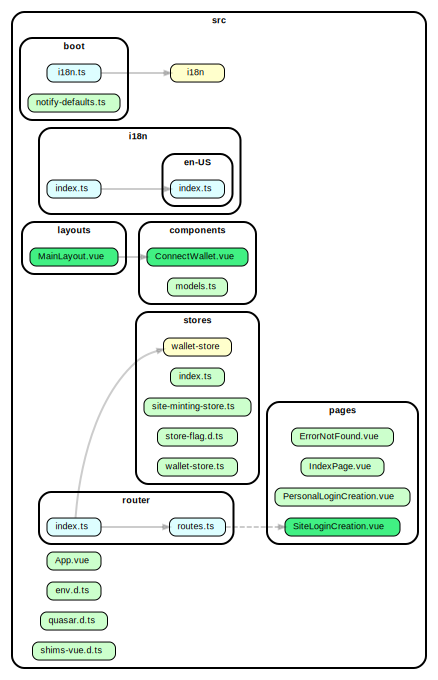
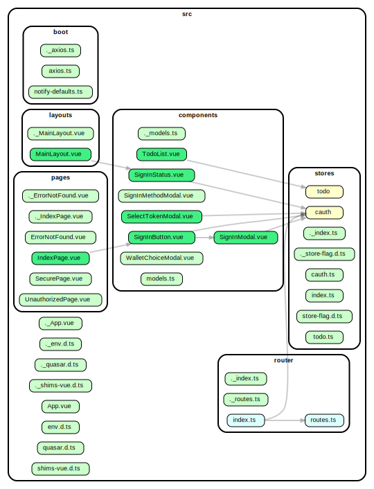
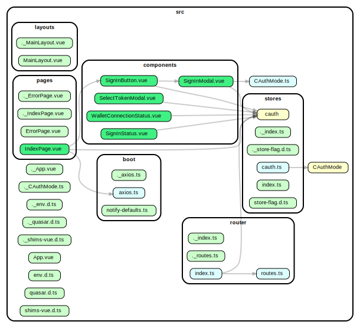

# TypeScript Security Audit Report

## 1. Audit Scope and Methodology

### 1.1 Components Reviewed

- [x] NFT Issuer
- [x] Frontend Library
- [x] Backend Library
- [x] OAuth Bridge Backend
- [x] OAuth Bridge Frontend
- [x] Browser Extension
- [x] Blockchain API Integration

### 1.2 Methodology

This security audit security audit begins with information gathering, where auditors clone the repository to identify file structures, map components, locate entry points, and generate dependency graphs for visualization. This reconnaissance phase establishes architectural context that informs targeted analysis of components including web applications, backends, browser extensions, and blockchain integrations. TypeScript-specific security checks follow, focusing on improper type usage, unsafe 'any' types, missing type guards, and inadequate input validation that could bypass TypeScript's safety features.
Configuration and dependency security represents a critical audit phase where tools scan for hardcoded secrets, analyze environment variable usage, implement git-secrets to prevent accidental exposure, and verify dependencies via npm audit and Snyk. Web application security testing examines authentication implementations, session management, authorization logic, and secure data transmission through HTTPS, CORS configurations, and proper cookie settings.
Comprehensive scanning tools complement manual inspection through Static Application Security Testing (SAST) with semgrep, continuous analysis with SonarQube, and specialized Node.js scanning with NodeJsScan. Integration points undergo dedicated testing with Dredd for APIs, web-ext for browser extensions, and specialized tools to ensure interfaces don't introduce additional vulnerabilities.
The audit methodology concludes with systematic consolidation of findings from all tools, prioritization by severity, and generation of an actionable security report. The approach leverages specialized tools across categories including TypeScript/JavaScript security, dependency management, browser extension analysis, blockchain security, and API testing. This comprehensive security approach addresses the diverse attack surfaces of modern TypeScript applications while providing practical, executable commands that balance automated scanning with targeted manual review.

## 2. Information Gathering and Architecture Analysis

### 2.1 Codebase Structure

#### 2.1.1 Frameworks & Libraries

[List major frameworks and libraries in use]

- NFT Issuer
  - @blockfrost/blockfrost-js - Javascript SDK for accessing Blockfrost API
  - @meshsdk/core - All-in-one TypeScript SDK for Cardano apps
  - quasar - Javascript UI framework for building Vuejs applications
  - pinia - Store library for Vuejs
  - vue - The progressive JavaScript framework for building modern web UI.
  - vue-router - Expressive, configurable and convenient routing for Vue.js
  - buffer - The buffer module from node.js, for the browser.
  - core-js - Modular standard library for JavaScript

- Frontend Library
  - @meshsdk/core - All-in-one TypeScript SDK for Cardano apps
  - axios - Promise based HTTP client for the browser and node.js
  - buffer - The buffer module from node.js, for the browser.
  - core-js - Modular standard library for JavaScript
  - pinia - Store library for Vuejs
  - quasar - Javascript UI framework for building Vuejs applications
  - vue - The progressive JavaScript framework for building modern web UI.
  - vue-router - Expressive, configurable and convenient routing for Vue.js

- Backend Library
  - cors - CORS is a node.js package for providing a Connect/Express middleware that can be used to enable Cross-Origin Resource Sharing with various options.
  - express - Fast, unopinionated, minimalist web framework for Node.js.
  - mongodb-memory-server - This package spins up an actual/real MongoDB server programmatically from within nodejs, for testing or mocking during development.
  - mongoose - Elegant MongoDB object modeling for Node.js

- OAuth Bridge Backend
  - @meshsdk/core - All-in-one TypeScript SDK for Cardano apps
  - cors - CORS is a node.js package for providing a Connect/Express middleware that can be used to enable Cross-Origin Resource Sharing with various options.
  - dotenv - Dotenv is a zero-dependency module that loads environment variables from a .env file into process.env
  - oauth2-server - Complete, framework-agnostic, compliant and well tested module for implementing an OAuth2 Server in node.js

- OAuth Bridge Frontend
  - quasar - Javascript UI framework for building Vuejs applications
  - axios - Promise based HTTP client for the browser and node.js
  - buffer - The buffer module from node.js, for the browser.
  - core-js - Modular standard library for JavaScript
  - pinia - Store library for Vuejs
  - quasar - Javascript UI framework for building Vuejs applications
  - vue - The progressive JavaScript framework for building modern web UI.
  - vue-router - Expressive, configurable and convenient routing for Vue.js

#### 2.1.2 Architecture Overview

- NFT Issuer
Application consists of a Vue+Quasar app (browser) that communicates with a Cardano wallet via CIP-30 "Cardano dApp-Wallet Web Bridge" API.

- Frontend Library
Application consists of a Vue+Quasar app (browser) that communicates with a Cardano wallet via CIP-30 "Cardano dApp-Wallet Web Bridge" API and a REST Client that connects to the backend.

- Backend Library
Application consists of MongoDB database and an Express application running a REST API.

- OAuth Bridge Backend
An Node.js Express server providing OAuth 2.0 compatible REST API. Communicates via Blockfrost API with Cardano Blockchain to verify claims.

- OAuth Bridge Frontend
A Vue+Quasar Frontend which allows user to choose Authentication NFT via CIP-30 API and then communicates with the backend to authorize via NFT and redirects to third party app with authorization token if the authorization was correct.

#### 2.1.3 Data Flow Map

[Describe how data flows between components]

- NFT Issuer
Communicates with a browser wallet via CIP-30 API to generate NFT token.

- Frontend Library
Communicates with a browser wallet via CIP-30 API to authenticate, stores authentication results in the backend via REST API, whi.

- Backend Library
Stores and checks authentication results, also directly against blockchain to protect against forgery.

- OAuth Bridge Frontend
Receives authentication request from third party app. After that it connects using CIP-30 API to browser wallet to authenticate. Sends authentication result to OAuth 2.0 backend and receives redirect URI. Connects back to the third party app.

- OAuth Bridge Backend
Receives authorization requests, verifies signatures (via meshsdk adn CIP-8)  and NFT ownership via Blockfrost.

### 2.2 Integration Points and Security Boundaries

#### 2.2.1 Web to Backend

- NFT Issuer
All communication happens locally in the browser via CIP-30 API

- Frontend Library
Communicates locally in the browser via CIP-30 API. Connects to the backend API

- Backend Library
  - POST `/api/cauth/login` - stores authentication data in MongoDB
  - GET `/api/cauth/check` - verifies authentication code

- OAuth Bridge Backend
  - `/api` - returns API status
  - GET `/api/authorize` - check if already authorized
  - POST `/api/authorize` - authorize new login and return redirect URI
  - GET `/api/clientName` - returns name of the client for the client_id
  - POST `/api/token` - method for refreshing authentication token
  - GET `/api/info` - returns login details for an Auth NFT

- OAuth Bridge Frontend
Communicates locally in the browser via CIP-30 API. Connects to the bridge API.

#### 2.2.2 Backend to Blockchain

- NFT Issuer
No direct interaction.
- Frontend Library
No direct interaction.
- Backend Library
No direct interaction, Blockfrost API used.
- OAuth Bridge Backend
No direct interaction, Blockfrost API used.
- OAuth Bridge Frontend
No direct interaction.

### 2.3 Missing Components or Documentation

All code has been provided.

## 3. Configuration and Dependency Management

### 3.1 Configuration Security

| Issue | Severity | Location | Description | Recommendation |
|-------|----------|----------|-------------|----------------|
| Hardcoded sensitive data | none | | | |
| Insecure default settings | none| | | |
| Environment separation issues | none | | | |
| Other configuration issues | none | | | |

### 3.2 Dependency Security

- NFT Issuer

| Issue | Severity | Location | Description | Recommendation |
|-------|----------|----------|-------------|----------------|
| Vulnerable dependencies |9 packages| | | update when fixed versions are available|
| Outdated packages | 1 package | | | update package and code to the change api|
| Abandoned dependencies |none| | | |
| Excessive dependency permissions |none| | | |

- Frontend Library

| Issue | Severity | Location | Description | Recommendation |
|-------|----------|----------|-------------|----------------|
| Vulnerable dependencies |20 packages| | | update when fixed versions are available|
| Outdated packages |none| | | |
| Abandoned dependencies |none| | | |
| Excessive dependency permissions |none| | | |

- Backend Library

| Issue | Severity | Location | Description | Recommendation |
|-------|----------|----------|-------------|----------------|
| Vulnerable dependencies |none| | | |
| Outdated packages |none| | | |
| Abandoned dependencies |none| | | |
| Excessive dependency permissions |none| | | |

- OAuth Bridge Backend

| Issue | Severity | Location | Description | Recommendation |
|-------|----------|----------|-------------|----------------|
| Vulnerable dependencies |5 packages| | | update when fixed versions are available|
| Outdated packages |none| | | |
| Abandoned dependencies |none| | | |
| Excessive dependency permissions |none| | | |

- OAuth Bridge Frontend

| Issue | Severity | Location | Description | Recommendation |
|-------|----------|----------|-------------|----------------|
| Vulnerable dependencies |5 packages| | | update when fixed versions are available|
| Outdated packages |none| | | |
| Abandoned dependencies |none| | | |
| Excessive dependency permissions |none| | | |

## 4. Web Applications and Backend Security

### 4.1 Authentication and Authorization

| Issue | Severity | Location | Description | Recommendation |
|-------|----------|----------|-------------|----------------|
| Password storage issues | none | | | |
| Weak session management | none | | | |
| Authentication bypass vulnerabilities | none | | | |
| Authorization flaws | none | | | |

### 4.2 Secure Data Transmission

| Issue | Severity | Location | Description | Recommendation |
|-------|----------|----------|-------------|----------------|
| Insecure SSL/TLS implementation |none| | | |
| Missing HSTS implementation |none| | | |
| Insecure cookie attributes |none| | | |
| Session tokens in URLs |none| | | |
| Other data transmission issues |none| | | |

## 5. Browser Extension Security Analysis

The applications are using external browser extensions, the security of these Cardano Wallets is out of scope of this security audit.

## 6. Blockchain API Integration Security

Blockfrost API used in the project is a separate service audited separately by its developers.

## 7. Automated Security Tools Results

### 7.1 Static Analysis Findings

We have performed a scan using OWASP retire tool. There are no high severity vulnerabilities. There are a few medium severity vulnerabilities in 3 packages axios, bootstrap and lodash.

### 7.2 Dependency Scanning Results

All possible packages have been updated, the vulnerable ones still needs to be updated by third parties. 

### 7.3 Configuration Scanning Results

Secrets are kept outside git, configuration is valid.

## 9. Overall Risk Assessment

### 9.1 Critical Findings

There are no critical findings.

### 9.2 High Risk Findings

There are no high risk issues

### 9.3 Medium Risk Findings

According to OWASP retire there are these medium security vulnerabilities, these vulnerabilites need to be fixed by third parties, because these packages are dependencies of other packages used:

lodash 4.17.19 has known vulnerabilities: severity: medium; summary: Regular Expression Denial of Service (ReDoS) in lodash, CVE: CVE-2020-28500, githubID: GHSA-29mw-wpgm-hmr9; https://github.com/advisories/GHSA-29mw-wpgm-hmr9 https://nvd.nist.gov/vuln/detail/CVE-2020-28500 https://github.com/lodash/lodash/pull/5065 https://github.com/lodash/lodash/pull/5065/commits/02906b8191d3c100c193fe6f7b27d1c40f200bb7 https://github.com/lodash/lodash/commit/c4847ebe7d14540bb28a8b932a9ce1b9ecbfee1a https://cert-portal.siemens.com/productcert/pdf/ssa-637483.pdf https://github.com/lodash/lodash https://github.com/lodash/lodash/blob/npm/trimEnd.js%23L8 https://security.netapp.com/advisory/ntap-20210312-0006/ https://snyk.io/vuln/SNYK-JAVA-ORGFUJIONWEBJARS-1074896 https://snyk.io/vuln/SNYK-JAVA-ORGWEBJARS-1074894 https://snyk.io/vuln/SNYK-JAVA-ORGWEBJARSBOWER-1074892 https://snyk.io/vuln/SNYK-JAVA-ORGWEBJARSBOWERGITHUBLODASH-1074895 https://snyk.io/vuln/SNYK-JAVA-ORGWEBJARSNPM-1074893 https://snyk.io/vuln/SNYK-JS-LODASH-1018905 https://www.oracle.com//security-alerts/cpujul2021.html https://www.oracle.com/security-alerts/cpujan2022.html https://www.oracle.com/security-alerts/cpujul2022.html https://www.oracle.com/security-alerts/cpuoct2021.html severity: high; summary: Command Injection in lodash, CVE: CVE-2021-23337, githubID: GHSA-35jh-r3h4-6jhm; https://github.com/advisories/GHSA-35jh-r3h4-6jhm https://nvd.nist.gov/vuln/detail/CVE-2021-23337 https://github.com/lodash/lodash/commit/3469357cff396a26c363f8c1b5a91dde28ba4b1c https://cert-portal.siemens.com/productcert/pdf/ssa-637483.pdf https://github.com/lodash/lodash https://github.com/lodash/lodash/blob/ddfd9b11a0126db2302cb70ec9973b66baec0975/lodash.js#L14851 https://github.com/lodash/lodash/blob/ddfd9b11a0126db2302cb70ec9973b66baec0975/lodash.js%23L14851 https://security.netapp.com/advisory/ntap-20210312-0006/ https://snyk.io/vuln/SNYK-JAVA-ORGFUJIONWEBJARS-1074932 https://snyk.io/vuln/SNYK-JAVA-ORGWEBJARS-1074930 https://snyk.io/vuln/SNYK-JAVA-ORGWEBJARSBOWER-1074928 https://snyk.io/vuln/SNYK-JAVA-ORGWEBJARSBOWERGITHUBLODASH-1074931 https://snyk.io/vuln/SNYK-JAVA-ORGWEBJARSNPM-1074929 https://snyk.io/vuln/SNYK-JS-LODASH-1040724 https://www.oracle.com//security-alerts/cpujul2021.html https://www.oracle.com/security-alerts/cpujan2022.html https://www.oracle.com/security-alerts/cpujul2022.html https://www.oracle.com/security-alerts/cpuoct2021.html

 ↳ axios 1.6.3
axios 1.6.3 has known vulnerabilities: severity: medium; summary: Versions before 1.6.8 depends on follow-redirects before 1.15.6 which could leak the proxy authentication credentials, PR: 6300; https://github.com/axios/axios/pull/6300 severity: high; summary: Server-Side Request Forgery in axios, CVE: CVE-2024-39338, githubID: GHSA-8hc4-vh64-cxmj; https://github.com/advisories/GHSA-8hc4-vh64-cxmj https://nvd.nist.gov/vuln/detail/CVE-2024-39338 https://github.com/axios/axios/issues/6463 https://github.com/axios/axios/pull/6539 https://github.com/axios/axios/pull/6543 https://github.com/axios/axios/commit/6b6b605eaf73852fb2dae033f1e786155959de3a https://github.com/axios/axios https://github.com/axios/axios/releases https://github.com/axios/axios/releases/tag/v1.7.4 https://jeffhacks.com/advisories/2024/06/24/CVE-2024-39338.html severity: high; summary: axios Requests Vulnerable To Possible SSRF and Credential Leakage via Absolute URL, CVE: CVE-2025-27152, githubID: GHSA-jr5f-v2jv-69x6; https://github.com/advisories/GHSA-jr5f-v2jv-69x6 https://github.com/axios/axios/security/advisories/GHSA-jr5f-v2jv-69x6 https://nvd.nist.gov/vuln/detail/CVE-2025-27152 https://github.com/axios/axios/issues/6463 https://github.com/axios/axios/commit/fb8eec214ce7744b5ca787f2c3b8339b2f54b00f https://github.com/axios/axios https://github.com/axios/axios/releases/tag/v1.8.2

 ↳ axios 0.21.4
axios 0.21.4 has known vulnerabilities: severity: medium; summary: Axios Cross-Site Request Forgery Vulnerability, CVE: CVE-2023-45857, githubID: GHSA-wf5p-g6vw-rhxx; https://github.com/advisories/GHSA-wf5p-g6vw-rhxx https://nvd.nist.gov/vuln/detail/CVE-2023-45857 https://github.com/axios/axios/issues/6006 https://github.com/axios/axios/issues/6022 https://github.com/axios/axios/pull/6028 https://github.com/axios/axios/commit/96ee232bd3ee4de2e657333d4d2191cd389e14d0 https://github.com/axios/axios/releases/tag/v1.6.0 https://security.snyk.io/vuln/SNYK-JS-AXIOS-6032459 severity: medium; summary: Versions before 1.6.8 depends on follow-redirects before 1.15.6 which could leak the proxy authentication credentials, PR: 6300; https://github.com/axios/axios/pull/6300 severity: high; summary: axios Requests Vulnerable To Possible SSRF and Credential Leakage via Absolute URL, CVE: CVE-2025-27152, githubID: GHSA-jr5f-v2jv-69x6; https://github.com/advisories/GHSA-jr5f-v2jv-69x6 https://github.com/axios/axios/security/advisories/GHSA-jr5f-v2jv-69x6 https://nvd.nist.gov/vuln/detail/CVE-2025-27152 https://github.com/axios/axios/issues/6463 https://github.com/axios/axios/commit/fb8eec214ce7744b5ca787f2c3b8339b2f54b00f https://github.com/axios/axios https://github.com/axios/axios/releases/tag/v1.8.2

 ↳ axios 0.21.4
axios 0.21.4 has known vulnerabilities: severity: medium; summary: Axios Cross-Site Request Forgery Vulnerability, CVE: CVE-2023-45857, githubID: GHSA-wf5p-g6vw-rhxx; https://github.com/advisories/GHSA-wf5p-g6vw-rhxx https://nvd.nist.gov/vuln/detail/CVE-2023-45857 https://github.com/axios/axios/issues/6006 https://github.com/axios/axios/issues/6022 https://github.com/axios/axios/pull/6028 https://github.com/axios/axios/commit/96ee232bd3ee4de2e657333d4d2191cd389e14d0 https://github.com/axios/axios/releases/tag/v1.6.0 https://security.snyk.io/vuln/SNYK-JS-AXIOS-6032459 severity: medium; summary: Versions before 1.6.8 depends on follow-redirects before 1.15.6 which could leak the proxy authentication credentials, PR: 6300; https://github.com/axios/axios/pull/6300 severity: high; summary: axios Requests Vulnerable To Possible SSRF and Credential Leakage via Absolute URL, CVE: CVE-2025-27152, githubID: GHSA-jr5f-v2jv-69x6; https://github.com/advisories/GHSA-jr5f-v2jv-69x6 https://github.com/axios/axios/security/advisories/GHSA-jr5f-v2jv-69x6 https://nvd.nist.gov/vuln/detail/CVE-2025-27152 https://github.com/axios/axios/issues/6463 https://github.com/axios/axios/commit/fb8eec214ce7744b5ca787f2c3b8339b2f54b00f https://github.com/axios/axios https://github.com/axios/axios/releases/tag/v1.8.2

 ↳ bootstrap 1.11.3
bootstrap 1.11.3 has known vulnerabilities: severity: medium; summary: cross-site scripting vulnerability, issue: 3421; https://github.com/twbs/bootstrap/pull/3421 severity: medium; summary: In Bootstrap before 3.4.0, XSS is possible in the tooltip data-viewport attribute., issue: 27044, CVE: CVE-2018-20676, githubID: GHSA-3mgp-fx93-9xv5; https://nvd.nist.gov/vuln/detail/CVE-2018-20676 severity: medium; summary: XSS in data-container property of tooltip, issue: 20184, CVE: CVE-2018-14042, githubID: GHSA-7mvr-5x2g-wfc8; https://github.com/twbs/bootstrap/issues/20184 severity: medium; summary: In Bootstrap before 3.4.0, XSS is possible in the affix configuration target property., CVE: CVE-2018-20677, githubID: GHSA-ph58-4vrj-w6hr; https://github.com/advisories/GHSA-ph58-4vrj-w6hr severity: medium; summary: Bootstrap Cross-Site Scripting (XSS) vulnerability for data-* attributes, CVE: CVE-2024-6485, githubID: GHSA-vxmc-5x29-h64v; https://github.com/advisories/GHSA-vxmc-5x29-h64v https://nvd.nist.gov/vuln/detail/CVE-2024-6485 https://github.com/twbs/bootstrap https://www.herodevs.com/vulnerability-directory/cve-2024-6485 severity: low; summary: Bootstrap before 4.0.0 is end-of-life and no longer maintained., retid: 72; https://github.com/twbs/bootstrap/issues/20631

 ↳ bootstrap 1.11.3
bootstrap 1.11.3 has known vulnerabilities: severity: medium; summary: cross-site scripting vulnerability, issue: 3421; https://github.com/twbs/bootstrap/pull/3421 severity: medium; summary: In Bootstrap before 3.4.0, XSS is possible in the tooltip data-viewport attribute., issue: 27044, CVE: CVE-2018-20676, githubID: GHSA-3mgp-fx93-9xv5; https://nvd.nist.gov/vuln/detail/CVE-2018-20676 severity: medium; summary: XSS in data-container property of tooltip, issue: 20184, CVE: CVE-2018-14042, githubID: GHSA-7mvr-5x2g-wfc8; https://github.com/twbs/bootstrap/issues/20184 severity: medium; summary: In Bootstrap before 3.4.0, XSS is possible in the affix configuration target property., CVE: CVE-2018-20677, githubID: GHSA-ph58-4vrj-w6hr; https://github.com/advisories/GHSA-ph58-4vrj-w6hr severity: medium; summary: Bootstrap Cross-Site Scripting (XSS) vulnerability for data-* attributes, CVE: CVE-2024-6485, githubID: GHSA-vxmc-5x29-h64v; https://github.com/advisories/GHSA-vxmc-5x29-h64v https://nvd.nist.gov/vuln/detail/CVE-2024-6485 https://github.com/twbs/bootstrap https://www.herodevs.com/vulnerability-directory/cve-2024-6485 severity: low; summary: Bootstrap before 4.0.0 is end-of-life and no longer maintained., retid: 72; https://github.com/twbs/bootstrap/issues/20631

 ↳ axios 1.6.3
axios 1.6.3 has known vulnerabilities: severity: medium; summary: Versions before 1.6.8 depends on follow-redirects before 1.15.6 which could leak the proxy authentication credentials, PR: 6300; https://github.com/axios/axios/pull/6300 severity: high; summary: Server-Side Request Forgery in axios, CVE: CVE-2024-39338, githubID: GHSA-8hc4-vh64-cxmj; https://github.com/advisories/GHSA-8hc4-vh64-cxmj https://nvd.nist.gov/vuln/detail/CVE-2024-39338 https://github.com/axios/axios/issues/6463 https://github.com/axios/axios/pull/6539 https://github.com/axios/axios/pull/6543 https://github.com/axios/axios/commit/6b6b605eaf73852fb2dae033f1e786155959de3a https://github.com/axios/axios https://github.com/axios/axios/releases https://github.com/axios/axios/releases/tag/v1.7.4 https://jeffhacks.com/advisories/2024/06/24/CVE-2024-39338.html severity: high; summary: axios Requests Vulnerable To Possible SSRF and Credential Leakage via Absolute URL, CVE: CVE-2025-27152, githubID: GHSA-jr5f-v2jv-69x6; https://github.com/advisories/GHSA-jr5f-v2jv-69x6 https://github.com/axios/axios/security/advisories/GHSA-jr5f-v2jv-69x6 https://nvd.nist.gov/vuln/detail/CVE-2025-27152 https://github.com/axios/axios/issues/6463 https://github.com/axios/axios/commit/fb8eec214ce7744b5ca787f2c3b8339b2f54b00f https://github.com/axios/axios https://github.com/axios/axios/releases/tag/v1.8.2

 ↳ axios 1.6.3
axios 1.6.3 has known vulnerabilities: severity: medium; summary: Versions before 1.6.8 depends on follow-redirects before 1.15.6 which could leak the proxy authentication credentials, PR: 6300; https://github.com/axios/axios/pull/6300 severity: high; summary: Server-Side Request Forgery in axios, CVE: CVE-2024-39338, githubID: GHSA-8hc4-vh64-cxmj; https://github.com/advisories/GHSA-8hc4-vh64-cxmj https://nvd.nist.gov/vuln/detail/CVE-2024-39338 https://github.com/axios/axios/issues/6463 https://github.com/axios/axios/pull/6539 https://github.com/axios/axios/pull/6543 https://github.com/axios/axios/commit/6b6b605eaf73852fb2dae033f1e786155959de3a https://github.com/axios/axios https://github.com/axios/axios/releases https://github.com/axios/axios/releases/tag/v1.7.4 https://jeffhacks.com/advisories/2024/06/24/CVE-2024-39338.html severity: high; summary: axios Requests Vulnerable To Possible SSRF and Credential Leakage via Absolute URL, CVE: CVE-2025-27152, githubID: GHSA-jr5f-v2jv-69x6; https://github.com/advisories/GHSA-jr5f-v2jv-69x6 https://github.com/axios/axios/security/advisories/GHSA-jr5f-v2jv-69x6 https://nvd.nist.gov/vuln/detail/CVE-2025-27152 https://github.com/axios/axios/issues/6463 https://github.com/axios/axios/commit/fb8eec214ce7744b5ca787f2c3b8339b2f54b00f https://github.com/axios/axios https://github.com/axios/axios/releases/tag/v1.8.2

 ↳ bootstrap 1.11.3
bootstrap 1.11.3 has known vulnerabilities: severity: medium; summary: cross-site scripting vulnerability, issue: 3421; https://github.com/twbs/bootstrap/pull/3421 severity: medium; summary: In Bootstrap before 3.4.0, XSS is possible in the tooltip data-viewport attribute., issue: 27044, CVE: CVE-2018-20676, githubID: GHSA-3mgp-fx93-9xv5; https://nvd.nist.gov/vuln/detail/CVE-2018-20676 severity: medium; summary: XSS in data-container property of tooltip, issue: 20184, CVE: CVE-2018-14042, githubID: GHSA-7mvr-5x2g-wfc8; https://github.com/twbs/bootstrap/issues/20184 severity: medium; summary: In Bootstrap before 3.4.0, XSS is possible in the affix configuration target property., CVE: CVE-2018-20677, githubID: GHSA-ph58-4vrj-w6hr; https://github.com/advisories/GHSA-ph58-4vrj-w6hr severity: medium; summary: Bootstrap Cross-Site Scripting (XSS) vulnerability for data-* attributes, CVE: CVE-2024-6485, githubID: GHSA-vxmc-5x29-h64v; https://github.com/advisories/GHSA-vxmc-5x29-h64v https://nvd.nist.gov/vuln/detail/CVE-2024-6485 https://github.com/twbs/bootstrap https://www.herodevs.com/vulnerability-directory/cve-2024-6485 severity: low; summary: Bootstrap before 4.0.0 is end-of-life and no longer maintained., retid: 72; https://github.com/twbs/bootstrap/issues/20631

 ↳ axios 0.27.2
axios 0.27.2 has known vulnerabilities: severity: medium; summary: Axios Cross-Site Request Forgery Vulnerability, CVE: CVE-2023-45857, githubID: GHSA-wf5p-g6vw-rhxx; https://github.com/advisories/GHSA-wf5p-g6vw-rhxx https://nvd.nist.gov/vuln/detail/CVE-2023-45857 https://github.com/axios/axios/issues/6006 https://github.com/axios/axios/issues/6022 https://github.com/axios/axios/pull/6028 https://github.com/axios/axios/commit/96ee232bd3ee4de2e657333d4d2191cd389e14d0 https://github.com/axios/axios/releases/tag/v1.6.0 https://security.snyk.io/vuln/SNYK-JS-AXIOS-6032459 severity: medium; summary: Versions before 1.6.8 depends on follow-redirects before 1.15.6 which could leak the proxy authentication credentials, PR: 6300; https://github.com/axios/axios/pull/6300 severity: high; summary: axios Requests Vulnerable To Possible SSRF and Credential Leakage via Absolute URL, CVE: CVE-2025-27152, githubID: GHSA-jr5f-v2jv-69x6; https://github.com/advisories/GHSA-jr5f-v2jv-69x6 https://github.com/axios/axios/security/advisories/GHSA-jr5f-v2jv-69x6 https://nvd.nist.gov/vuln/detail/CVE-2025-27152 https://github.com/axios/axios/issues/6463 https://github.com/axios/axios/commit/fb8eec214ce7744b5ca787f2c3b8339b2f54b00f https://github.com/axios/axios https://github.com/axios/axios/releases/tag/v1.8.2

 ↳ axios 0.27.2
axios 0.27.2 has known vulnerabilities: severity: medium; summary: Axios Cross-Site Request Forgery Vulnerability, CVE: CVE-2023-45857, githubID: GHSA-wf5p-g6vw-rhxx; https://github.com/advisories/GHSA-wf5p-g6vw-rhxx https://nvd.nist.gov/vuln/detail/CVE-2023-45857 https://github.com/axios/axios/issues/6006 https://github.com/axios/axios/issues/6022 https://github.com/axios/axios/pull/6028 https://github.com/axios/axios/commit/96ee232bd3ee4de2e657333d4d2191cd389e14d0 https://github.com/axios/axios/releases/tag/v1.6.0 https://security.snyk.io/vuln/SNYK-JS-AXIOS-6032459 severity: medium; summary: Versions before 1.6.8 depends on follow-redirects before 1.15.6 which could leak the proxy authentication credentials, PR: 6300; https://github.com/axios/axios/pull/6300 severity: high; summary: axios Requests Vulnerable To Possible SSRF and Credential Leakage via Absolute URL, CVE: CVE-2025-27152, githubID: GHSA-jr5f-v2jv-69x6; https://github.com/advisories/GHSA-jr5f-v2jv-69x6 https://github.com/axios/axios/security/advisories/GHSA-jr5f-v2jv-69x6 https://nvd.nist.gov/vuln/detail/CVE-2025-27152 https://github.com/axios/axios/issues/6463 https://github.com/axios/axios/commit/fb8eec214ce7744b5ca787f2c3b8339b2f54b00f https://github.com/axios/axios https://github.com/axios/axios/releases/tag/v1.8.2

### 9.4 Low Risk Findings

There are no low risk issues.

## 10. Recommendations and Remediation Plan

### 10.1 Immediate Actions

There are no actions that can be taken immediately. Vulnerable packages need to be monitored for updates.

### 10.2 Short-term Improvements

Monitor vulnerable packages for updates and update when possible.

### 10.3 Long-term Security Enhancements

Update to newest version of nodejs, consider switching rewriting Javascript in Typescript.

